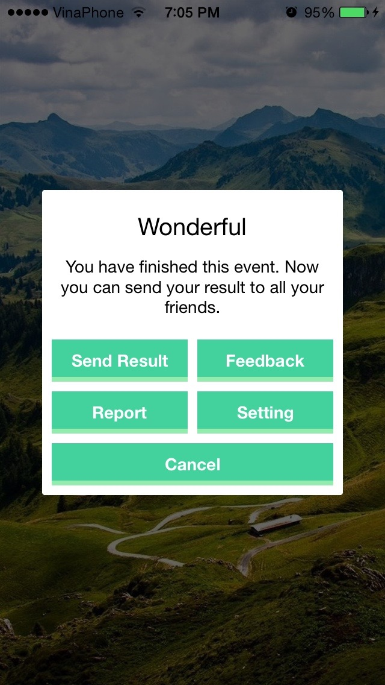

# DVAlertViewController
DVAlertViewController is a third party that helps you to display many types of alert and you can customize it if you want. I want to use a new kind of AlertViewController instead of Apple's so i have decided to create it. Hope you like it ! Thanks



## Setup
Go to anywhere you want to show your alert and write the following code below:
```
var alert = DVAlertViewController()
```
It's used to create a new alert. There are 6 types of DVAlertViewController that will assist you to create any kinds of alert you desire. They are:
### Success Alert:
```
alert.showAlertSuccess(target: self, delegate: self, title:"Wonderful", subTitle: "You have finished this event. Now you can send your result to all your friends.", duration: 0.8, cancelButtonTitle: "Cancel", otherButtonsTitles: ["Send Result", "Feedback", "Report", "Setting"], animate: true)
```

### Info Alert:
```
alert.showAlertInfo(target: self, delegate: self, title:"Wonderful", subTitle: "You have finished this event. Now you can send your result to all your friends.", duration: 0.7, cancelButtonTitle: "Cancel", otherButtonsTitles: ["Send Result", "Feedback"], animate: true)
```

### Warning Alert:
```
alert.showAlertWarning(target: self, delegate: self, title:"Wonderful", subTitle: "You have finished this event. Now you can send your result to all your friends.", duration: 0.8, cancelButtonTitle: "Cancel", otherButtonsTitles: ["Send Result", "Feedback"], animate: true)
```

### Error Alert:
```
alert.showAlertError(target: self, title: "Errors detected", subTitle: "You are in trouble!!! There are so many errors right here, please do something or your device will be destroyed !!!", cancelButtonTitle: "I know it")
```

### Notice Alert:
```
alert.showAlertNotice(target: self, delegate: self, title:"Wonderful", subTitle: "You have finished this event. Now you can send your result to all your friends.", duration: 0.7, cancelButtonTitle: "Cancel", otherButtonsTitles: ["Send Result", "Feedback"], animate: true)
```

### Normal Alert:
```
alert.showAlertNormal(target: self, delegate: self, title:"Wonderful", subTitle: "You have finished this event. Now you can send your result to all your friends.", duration: 0.7, cancelButtonTitle: "Cancel", otherButtonsTitles: ["Send Result", "Feedback"], animate: true)
```

>Let's take a look at this code, there are something you may want to know:
* target: The ViewController you want to display your alert.
* delegate: The DVAlertViewDelegate, if you want to detect any states of DVAlertViewController, you need to use this.
* title: Your alert's title.
* subTitle: Your alert's subtitle.
* duration: Time to display your alert.
* cancelButtonTitle: The title of your cancel button.
* otherButtonTitles: There is one title for each button, if you want more buttons, insert the button'titles to this array.
* animate: The animation of the alert, if you want it, write true, conversely, write false.

## Customizing your alert
Wow, now you want create your own alert, let's do it!
First, create a new DVAlertViewController:
```
var al = DVAlertViewController()
```

Now if you want to add some button, you can write your code like this:
```
al.addButtonWithTitle(title: "Hello world 1", buttonType: .Normal, alertViewStyle: .Info)
al.addButtonWithTitle(title: "Hello world 2", buttonType: .Normal, alertViewStyle: .Info)
al.addButtonWithTitle(title: "Hello world 3", buttonType: .Normal, alertViewStyle: .Info)
al.addButtonWithTitle(title: "Hello world 4", buttonType: .Normal, alertViewStyle: .Info)
al.addButtonWithTitle(title: "Cancel", buttonType: .Cancel, alertViewStyle: .Info)
```

You want to show some text right? Let's write this code:
```
al.alertTitle = "Hello all you guys"
al.alertSubTitle = "I'm so happy to be here..."
```

You can also set the time interval for your alert:
```
al.duration = 0.7
```

Don't forget to tell DVAlertViewController which is your target:
```
al.target = self
```

You can set the delegate if you want, it's up to you:
```
al.delegate = self
```

Wow... So many things right? Now let's show the alert:
```
al.showAlert(animate: true)
```
Well done my friend! Now you can see an alert has showed up.

## DVAlertViewController Delegate
As i said above, you use delegate to detect any states of DVAlertViewController, so i bring to you some functions:
```
optional func dvAlertViewWillAppear(#dvAlertView: DVAlertViewController)
optional func dvAlertViewWillDisappear(#dvAlertView: DVAlertViewController)
optional func dvAlertViewDidAppear(#dvAlertView: DVAlertViewController)
optional func dvAlertViewDidDisappear(#dvAlertView: DVAlertViewController)
optional func dvAlertView(#dvAlertView: DVAlertViewController, didClickButtonAtIndex: Int)
```

As you see, it's just optional, so in your code, write any functions you want, for example:
```
func dvAlertView(dvAlertView: DVAlertViewController, didClickButtonAtIndex: Int) {
    switch(didClickButtonAtIndex) {
    case 0:
        println("\(didClickButtonAtIndex) was clicked so this alert will be hided")
    case 1:
        println("\(didClickButtonAtIndex) was clicked again")
    case 2:
        println("\(didClickButtonAtIndex) was clicked three times")
    case 3:
        println("\(didClickButtonAtIndex) was clicked again and again")
    case 4:
        println("\(didClickButtonAtIndex) was clicked very hard")
    default:
        break
    }
}

func dvAlertViewWillAppear(#dvAlertView: DVAlertViewController) {
    println("Will appear")
}

func dvAlertViewDidAppear(#dvAlertView: DVAlertViewController) {
    println("Did appear")
}

func dvAlertViewWillDisappear(#dvAlertView: DVAlertViewController) {
    println("Will disappear")
}

func dvAlertViewDidDisappear(#dvAlertView: DVAlertViewController) {
    println("Did disappear")
}
```
It's so easy right?
### If you have any troubles, please tell me and i'll try to fix it as soon as possible :) Thank you!
